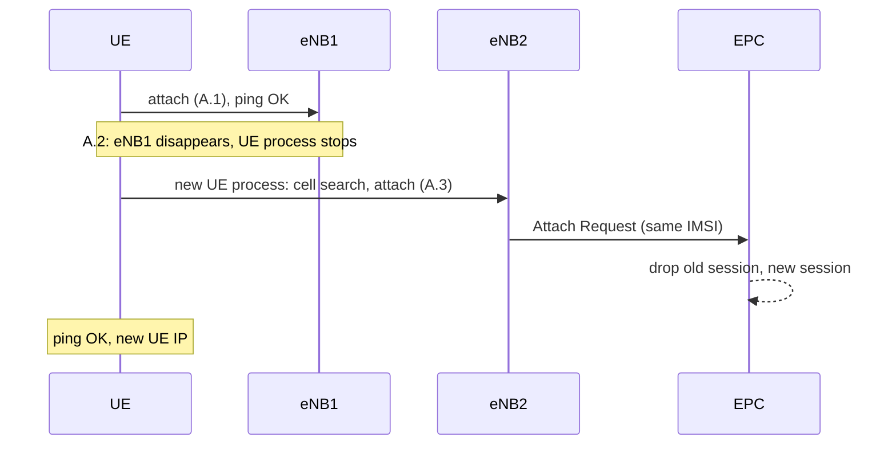
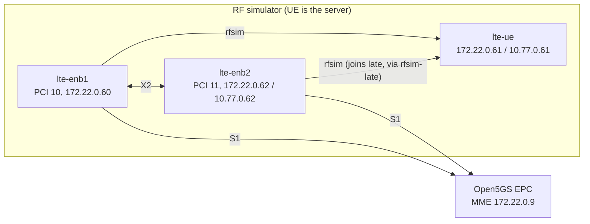
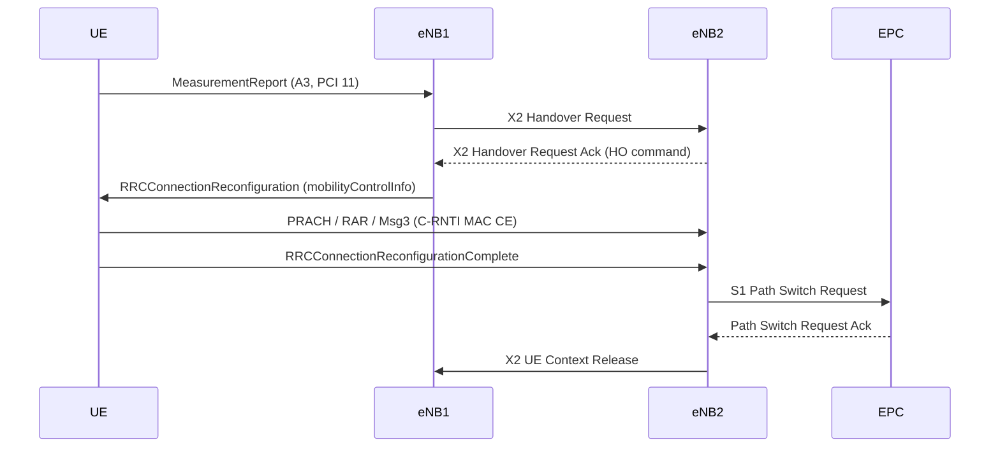

# LTE mobility between two eNBs: RRC_IDLE and RRC_CONNECTED (RF simulator)

This tutorial moves one LTE UE from **eNB1** (PCI 10) to **eNB2** (PCI 11) in the two RRC modes. Everything runs in docker: `lte-uesoftmodem`, two `lte-softmodem` instances, and an Open5GS EPC.

| Mode | How the UE gets from eNB1 to eNB2 in OAI | Part |
|---|---|---|
| **RRC_IDLE** | **Break-before-make.** The OAI LTE UE has no idle-mode cell reselection, so the UE process is restarted and attaches again through eNB2. | [Part A](#part-a-rrc_idle-break-before-make) |
| **RRC_CONNECTED** | **X2 handover:** A3 → MeasurementReport → X2 HO Request/Ack → HO command → random access on eNB2 → ReconfigurationComplete → S1 Path Switch → eNB1 releases the UE context. | [Part B](#part-b-rrc_connected-x2-handover) |

> Code requirement: branch `fix/lte-sw`. Part B depends on its LTE handover fixes (UE measurements/A3, UE handover execution, random access with C-RNTI on the target, X2/SCTP/GTP fixes, rfsim `sync_clients`); stock OAI `develop` does not complete it. Part A uses only standard attach. See `lessons.md` L1–L3.

[[_TOC_]]

## Common setup

### Prerequisites

- Linux host with docker and a bash shell. All commands below are bash; with fish, run `bash` first.
- About 12 free CPU cores (each container is pinned to 4 cores).
- The duranta-oai source on branch `fix/lte-sw`.

Set these variables in every shell you use:

```bash
OAI=$HOME/duranta-oai          # source tree, branch fix/lte-sw
BUILD=$OAI/build               # build directory (also used as the containers' run directory)
CONF=$OAI/ci-scripts/conf_files
IMG=ntn-dev                    # image with the OAI build dependencies plus ping/ip (see step 1)
```

### 1. Build image

Any image that contains the OAI build dependencies works. Build the official base image, then add `ping` and `ip`:

```bash
cd $OAI
docker build . -f docker/Dockerfile.base.ubuntu -t ran-base
printf 'FROM ran-base\nRUN apt-get update && apt-get install -y iputils-ping iproute2 && rm -rf /var/lib/apt/lists/*\n' \
  | docker build -t $IMG -
```

> If the host needs an HTTP proxy, add `--network host --build-arg http_proxy=... --build-arg https_proxy=...` to the `docker build` commands.

### 2. Build OAI

The source is mounted read-only. The build directory is mounted read-write.

```bash
mkdir -p $BUILD
docker run --rm -v $OAI:/oai-ran:ro -v $BUILD:/build -w /build $IMG bash -c '
  cmake /oai-ran -GNinja -DENABLE_TELNETSRV=ON &&
  ninja lte-softmodem lte-uesoftmodem conf2uedata rfsimulator telnetsrv telnetsrv_enb \
        coding dfts params_libconfig'
```

> cmake downloads dependencies through CPM. If that times out inside the container, pre-download them on the host and pass the cache with `-v <cache>:/cpm -DCPM_SOURCE_CACHE=/cpm`.

Check that the build produced its outputs:

```bash
ls $BUILD/lte-softmodem $BUILD/lte-uesoftmodem $BUILD/conf2uedata $BUILD/librfsimulator.so $BUILD/libtelnetsrv_enb.so
```

### 3. Core network (Open5GS EPC)

We use the Open5GS docker deployment in `SaTrinity/open5gs-docker` (docker network `docker_open5gs_default`, 172.22.0.0/16, PLMN 001/01).

**3.1 Start the EPC components.** The MME must not use SGsAP, because no MSC is deployed. Delete the `sgsap:` block (and its indented lines) from `open5gs-docker/mme/mme.yaml`, then run:

```bash
cd ~/paper/SaTrinity/open5gs-docker
docker compose -f deploy-all.yaml up -d --no-deps mongo webui nrf scp hss pcrf sgwc sgwu amf smf upf mme
docker ps --format '{{.Names}}' | grep -E '^(mongo|hss|pcrf|sgwc|sgwu|smf|upf|mme)$' | sort
```

All 8 names must be listed. In this deployment, the SMF and UPF act as the PGW, and the MME is at 172.22.0.9.

**3.2 Add the subscriber** (once). It must match `ci-scripts/conf_files/lteue.usim-open5gs.conf`:

| IMSI | K | OPc | APN |
|---|---|---|---|
| 001010000000001 | 465b5ce8b199b49faa5f0a2ee238a6bc | e8ed289deba952e4283b54e88e6183ca | internet (default) |

```bash
docker cp hss:/open5gs/misc/db/open5gs-dbctl /tmp/open5gs-dbctl
docker cp /tmp/open5gs-dbctl mongo:/tmp/open5gs-dbctl
docker exec mongo bash /tmp/open5gs-dbctl --db_uri=mongodb://localhost/open5gs \
  add 001010000000001 465b5ce8b199b49faa5f0a2ee238a6bc e8ed289deba952e4283b54e88e6183ca
docker exec mongo mongosh --quiet --eval \
  'db.getSiblingDB("open5gs").subscribers.countDocuments({imsi:"001010000000001"})'   # prints 1
```

**3.3 Create the late-join network** (once; used by Part B and the optional check in Part A):

```bash
docker network create --subnet 10.77.0.0/24 rfsim-late
```

### 4. Helper functions

Paste these into the shell:
- `oai_run` starts one container.
- `tn` sends one telnet command to a softmodem inside its container.
- `ue_start` and `enb_args` hold the UE command and the common eNB arguments.
- `wait_attach` waits until the UE has attached.

```bash
oai_run() { local name=$1 cpus=$2 ip=$3; shift 3
  docker rm -f $name >/dev/null 2>&1; mkdir -p $BUILD/run/$name
  docker run -d --name $name --cpuset-cpus $cpus --privileged \
    --network docker_open5gs_default --ip $ip \
    -v $OAI:$OAI:ro -v $BUILD:/build -w /build/run/$name $IMG "$@"; }
tn() { docker exec $1 bash -c "exec 3<>/dev/tcp/127.0.0.1/9090; echo '$2' >&3; timeout 1 cat <&3" | tr -d '\r'; }
LOG="--log_config.global_log_options level,nocolor,time"
TELNET="--telnetsrv --telnetsrv.listenaddr 127.0.0.1"
```

The UE is always the **rfsim server**, and the eNBs connect to it as clients. `conf2uedata` turns the USIM conf into the UE's NAS files in its run directory. A fresh run directory means a fresh USIM, so every start is a new IMSI attach.

```bash
ue_start() { oai_run lte-ue 0-3 172.22.0.61 bash -c "/build/conf2uedata -c $CONF/lteue.usim-open5gs.conf -o . && \
  exec /build/lte-uesoftmodem -O $CONF/lteue.rfsim.conf --rfsim --rfsimulator.[0].serveraddr server \
  --rfsimulator.[0].sync_clients 1 -C 2680000000 -r 25 --ue-rxgain 140 --ue-txgain 120 $TELNET $LOG"; }
wait_attach() { local t0=$(date +%s)
  until docker logs lte-ue 2>&1 | grep -q 'Send Attach Complete'; do sleep 1; done
  echo "attached in $(( $(date +%s) - t0 )) s"; }
```

The eNB arguments start from the CI config `enb.band7.25prb.rfsim.conf` (band 7, 5 MHz). They override the PLMN, the MME address, the local addresses, X2, the rfsim server address and the transmit gain on the command line:

```bash
enb_args() { local ip=$1 id=$2 pci=$3 rfsrv=$4 gain=$5
  echo /build/lte-softmodem -O $CONF/enb.band7.25prb.rfsim.conf --rfsim \
    --rfsimulator.[0].serveraddr $rfsrv --rfsimulator.[0].enable_beams 1 --rfsimulator.[0].beam_gains $gain \
    --eNBs.[0].eNB_ID $id --eNBs.[0].component_carriers.[0].Nid_cell $pci \
    --eNBs.[0].plmn_list.[0].mcc 1 --eNBs.[0].plmn_list.[0].mnc 1 \
    --eNBs.[0].mme_ip_address.[0].ipv4 172.22.0.9 \
    --eNBs.[0].NETWORK_INTERFACES.ENB_IPV4_ADDRESS_FOR_S1_MME $ip \
    --eNBs.[0].NETWORK_INTERFACES.ENB_IPV4_ADDRESS_FOR_S1U $ip \
    --eNBs.[0].NETWORK_INTERFACES.ENB_IPV4_ADDRESS_FOR_X2C $ip \
    --eNBs.[0].enable_x2 yes $TELNET $LOG; }
```

| Node | Container | IP | eNB_ID | PCI |
|---|---|---|---|---|
| UE (rfsim server) | `lte-ue` | 172.22.0.61 (+ 10.77.0.61 in Part B) | – | – |
| eNB1 | `lte-enb1` | 172.22.0.60 | 3585 | 10 |
| eNB2 | `lte-enb2` | 172.22.0.62 (+ 10.77.0.62 in Part B) | 3586 | 11 |

## Part A: RRC_IDLE (break-before-make)

**Why break-before-make.** In RRC_IDLE the UE should change cells by itself, through cell reselection. The OAI LTE UE cannot do that (`lessons.md` L2):
- No reselection: SIB3 reselection parameters are only printed.
- No Service Request: a released UE cannot reconnect.
- UE NAS never reaches EMM-REGISTERED.

The only way to move the UE to eNB2 is to restart the UE process and attach again through eNB2. In the paper, this is the "break-before-make" baseline.



**A.1 UE → eNB1.** Start the UE, then eNB1 (0 dB gain), and wait for the attach (a few seconds):

```bash
ue_start; sleep 3
oai_run lte-enb1 4-7 172.22.0.60 $(enb_args 172.22.0.60 3585 10 172.22.0.61 0)
wait_attach
docker logs lte-ue 2>&1 | grep -m1 'NidCell'                # ... NidCell 10 ...: camped on eNB1
docker exec lte-ue ip -br addr show oaitun_ue1              # note the UE IP
docker exec lte-ue ping -I oaitun_ue1 -c 5 192.168.96.1
```

**A.2 Leave eNB1.** eNB1 disappears (the UE has left its coverage), and the UE process is stopped. It cannot continue on its own; see [A.5](#a5-optional-see-that-the-ue-does-not-reselect-by-itself).

```bash
T0=$(date +%s)
docker rm -f lte-ue lte-enb1
```

**A.3 UE → eNB2.** Start a new UE process, and let eNB2 connect to it directly:

```bash
ue_start; sleep 3
oai_run lte-enb2 8-11 172.22.0.62 $(enb_args 172.22.0.62 3586 11 172.22.0.61 0)
wait_attach
echo "eNB1 -> eNB2 took $(( $(date +%s) - T0 )) s"
```

**A.4 Verify.**

```bash
docker logs lte-ue 2>&1 | grep -m1 'NidCell'                # ... NidCell 11 ...: camped on eNB2
docker exec lte-ue ip -br addr show oaitun_ue1              # a new UE IP
docker exec lte-ue ping -I oaitun_ue1 -c 5 192.168.96.1
docker logs mme --since 2m 2>&1 | grep -E 'known UE by IMSI|Removed Session|Attach complete'
```

Expected (measured):
- The UE attaches through PCI 11, and ping works.
- The MME reports `known UE by IMSI`, removes the old session (`Removed Session`), creates a new one and logs `Attach complete`.
- The **UE IP changes** (e.g. `192.168.100.229` → `192.168.100.232`), so ongoing connections break.
- Total time from A.2 to the attach is **about 10 s**. It includes container start, UE cell search and a full attach.

**A.5 (optional) See that the UE does not reselect by itself.** Bring eNB2 on air while the UE is attached to eNB1, then remove eNB1. eNB2 joins late through `rfsim-late`, for the reason explained in [Part B](#how-the-setup-works).

```bash
docker rm -f lte-ue lte-enb1 lte-enb2 2>/dev/null
ue_start; sleep 3
oai_run lte-enb1 4-7 172.22.0.60 $(enb_args 172.22.0.60 3585 10 172.22.0.61 0); sleep 1
oai_run lte-enb2 8-11 172.22.0.62 $(enb_args 172.22.0.62 3586 11 10.77.0.61 0)
docker network connect --ip 10.77.0.62 rfsim-late lte-enb2
wait_attach; sleep 3
docker network connect --ip 10.77.0.61 rfsim-late lte-ue
until docker logs lte-enb2 2>&1 | grep -q 'Connection to 10.77.0.61'; do sleep 1; done; echo "eNB2 on air"
docker rm -f lte-enb1; sleep 30
docker exec lte-ue ping -I oaitun_ue1 -c 3 -W 2 192.168.96.1    # 100% loss
docker logs lte-ue 2>&1 | tail -5                               # Lost socket, Release all SRs
docker logs lte-enb2 2>&1 | grep -c RAPROC                      # 0: the UE never tried eNB2
```

eNB2 is on air at the same strength eNB1 had. Even so, the UE only logs `Lost socket` and `Release all SRs`. It does no radio link failure handling, no reselection, and no random access to eNB2. Clean up with `docker rm -f lte-ue lte-enb2`.

## Part B: RRC_CONNECTED (X2 handover)

### How the setup works



- **Both cells reach the UE at once.** Both eNBs are rfsim clients of the UE, so the UE receives the sum of both cells, as on a real radio. It can measure eNB2 while it is served by eNB1.
- **eNB2 joins the radio late.** A second rfsim client present at UE startup breaks the LTE UE's initial cell search.
  - eNB2 is started early, so that X2 Setup with eNB1 completes.
  - Its rfsim server address is on a separate docker network, `rfsim-late`. The UE is connected to that network only after it has attached through eNB1.
- **`sync_clients`** (UE rfsim option) puts every client on a common 1024-frame grid. The two cells are then frame-synchronous, as LTE intra-frequency handover expects.
- **Radio conditions trigger the handover.** eNB2's transmit gain starts at -20 dB and is raised step by step over telnet (`rfsimu setbeamgains`). When eNB2 is a few dB stronger, the UE's A3 event fires and the network performs the handover.



### B.1 UE → eNB1

Start the UE and eNB1. Then start eNB2 (X2 peer eNB1, 20 dB weaker), which keeps retrying its rfsim connection to 10.77.0.61 while X2 Setup completes:

```bash
docker rm -f lte-ue lte-enb1 lte-enb2 2>/dev/null
ue_start; sleep 3
oai_run lte-enb1 4-7 172.22.0.60 $(enb_args 172.22.0.60 3585 10 172.22.0.61 0); sleep 1
oai_run lte-enb2 8-11 172.22.0.62 $(enb_args 172.22.0.62 3586 11 10.77.0.61 -20) \
  --eNBs.[0].target_enb_x2_ip_address.[0].ipv4 172.22.0.60
docker network connect --ip 10.77.0.62 rfsim-late lte-enb2
wait_attach
docker exec lte-ue ip -br addr show oaitun_ue1                                     # note the UE IP
docker exec lte-ue ping -I oaitun_ue1 -c 5 192.168.96.1                            # through eNB1
docker logs lte-enb2 2>&1 | grep -c 'x2ap_eNB_decode_successfuloutcome_message'   # 1: X2 Setup done
```

If the attach does not finish within about 60 s, see [Troubleshooting](#troubleshooting).

### B.2 Bring eNB2 on air

Connect the UE to `rfsim-late`. eNB2's pending rfsim connection now succeeds:

```bash
sleep 3
docker network connect --ip 10.77.0.61 rfsim-late lte-ue
until docker logs lte-enb2 2>&1 | grep -q 'Connection to 10.77.0.61'; do sleep 1; done; echo "eNB2 on air"
```

### B.3 UE → eNB2 (handover)

Raise eNB2's gain until the UE hands over. This normally happens around +0.5 dB:

```bash
for g in -6 -4 -3 -2 -1.5 -1 -0.5 0 0.5 1 1.5 2; do
  tn lte-enb2 "rfsimu setbeamgains $g" >/dev/null; sleep 2
  docker logs lte-ue 2>&1 | grep -q 'handover to PCI 11' && { echo "handover at eNB2 gain $g dB"; break; }
done
```

### B.4 Verify

Ping again. The traffic now goes through eNB2, and the **UE IP is unchanged**:

```bash
sleep 3
docker exec lte-ue ip -br addr show oaitun_ue1
docker exec lte-ue ping -I oaitun_ue1 -c 5 192.168.96.1
```

Check the log markers:

```bash
docker logs lte-ue   2>&1 | grep -E 'handover to PCI|contention resolved|Handover failure'
docker logs lte-enb2 2>&1 | grep -E 'in Msg3|ReconfigurationComplete from UE|PATH_SWITCH_REQ_ACK'
docker logs lte-enb1 2>&1 | grep -E 'X2AP_UE_CONTEXT_RELEASE'
```

| Where | Log line | Meaning |
|---|---|---|
| UE | `handover to PCI 11` | HO command received from eNB1 (prepared by eNB2 over X2) |
| UE | `UL grant on C-RNTI xxxx, contention resolved` | Random access on eNB2 succeeded |
| eNB2 | `CRNTI xxxx (UE_id 0) in Msg3` | eNB2 identified the UE by its new C-RNTI |
| eNB2 | `Received LTE_RRCConnectionReconfigurationComplete` | Handover complete at RRC level |
| eNB2 | `Received S1AP_PATH_SWITCH_REQ_ACK` | MME/SGW moved the downlink tunnel to eNB2 |
| eNB1 | `X2AP_UE_CONTEXT_RELEASE` | Source released the UE |
| UE | `Handover failure` must **not** appear | T304 did not expire |

eNB2's MAC statistics in `$BUILD/run/lte-enb2/MAC_stats.log` should show the new RNTI `in synch` with `ULSCH errors 0`.

### B.5 (optional) Hand back, and measure the interruption

**Hand back to eNB1.** Lower eNB2 again. The handover back normally happens around -1 dB:

```bash
for g in 0 -1 -2 -3 -4 -6; do
  tn lte-enb2 "rfsimu setbeamgains $g" >/dev/null; sleep 2
  docker logs lte-ue 2>&1 | grep -q 'handover to PCI 10' && { echo "back to eNB1 at eNB2 gain $g dB"; break; }
done
docker exec lte-ue ping -I oaitun_ue1 -c 5 192.168.96.1
```

**User-plane interruption.** Run a fast ping in the background, trigger a handover within about 20 s (B.3, or the step above), then count the missing sequence numbers:

```bash
docker exec -d lte-ue bash -c 'ping -I oaitun_ue1 -i 0.01 -w 25 192.168.96.1 > /tmp/ping.log'
# ... trigger the handover now, then wait until the 25 s ping has finished ...
docker exec lte-ue cat /tmp/ping.log | grep -o 'icmp_seq=[0-9]*' | cut -d= -f2 \
  | awk 'NR>1 && $1>p+1 {print "gap:", $1-p-1, "packets (x10 ms)"} {p=$1}'
```

Measured in three runs: one gap per handover of 3, 30 and 84 packets (30–840 ms). The length varies a lot between runs. There is no X2-U data forwarding, so packets in flight at the switch are lost.

Use the gaps, not ping's overall loss percentage. The percentage also counts the packets still in flight when `-w` stops the ping.

## Summary

| | RRC_IDLE (Part A) | RRC_CONNECTED (Part B) |
|---|---|---|
| Mechanism | UE process restart + new attach (break-before-make) | X2 handover (network controlled) |
| Triggered by | Restarting the UE (no idle-mode reselection in OAI) | A3 measurement event |
| Core network | New attach; old session removed | S1 Path Switch; same session |
| UE IP | Changes | Kept |
| Interruption (measured) | About 10 s | 30–840 ms (3 runs) |
| Code | Any OAI | `fix/lte-sw` |

**Clean up:**

```bash
docker rm -f lte-ue lte-enb1 lte-enb2
```

## Troubleshooting

| Symptom | Cause / fix |
|---|---|
| UE never attaches; UE log keeps resynchronizing | Was a second eNB already on the radio at UE startup? Only one eNB may connect at UE startup; eNB2 joins later through `rfsim-late` (B.2). Rerun from the first command of the part. |
| Attach rejected, or no `Send Attach Complete` | Check the subscriber (3.2) and the PLMN 001/01. Look for the IMSI in `docker logs mme`. |
| eNB does not connect to the MME | Is `mme` running, and has SGsAP been removed from `mme.yaml` (3.1)? |
| Part B: A3 fires as soon as eNB2 joins, then no handover (UE log `Release all SRs`) | You used a UE config with a channel model (`options = ("chanmod")`). Use the plain `lteue.rfsim.conf`, as `ue_start` does. |
| Part B: `handover to PCI 11` appears, then `Handover failure` | The UE's random access on eNB2 failed. Check `docker logs lte-enb2` for `in Msg3`, and check that the binaries are built from `fix/lte-sw`. |
| Part B: ping fails after the handover | Check eNB2's log for `PATH_SWITCH_REQ_ACK`, and the UE log for `DRB 01 Action ADD` under the new RNTI. |
| `tn` prints nothing | The softmodem was started without `$TELNET`, or `libtelnetsrv*.so` was not built. |

Debugging tips:
- Add `--log_config.phy_log_level debug` to one eNB for PHY details (e.g. `sync_pos`, CRC). It writes about 1 GB of logs per minute, so stop the container right after the event.
- The telnet command `softmodem log` crashes the LTE UE; don't use it.
